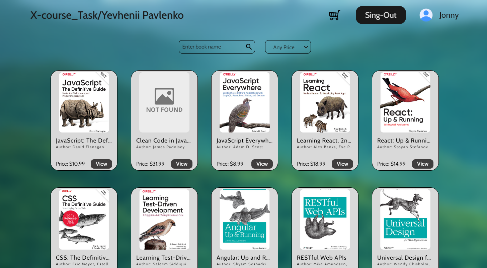
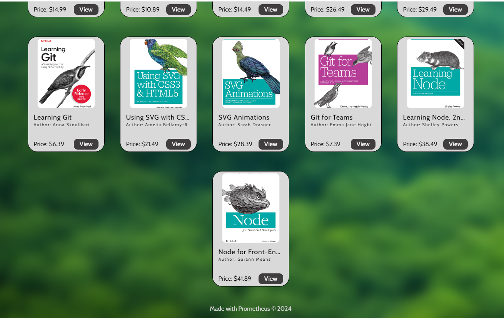
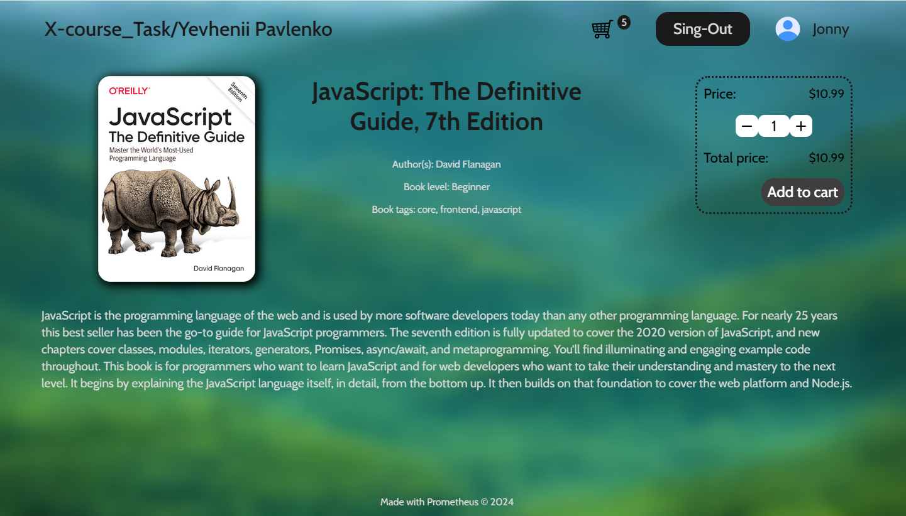
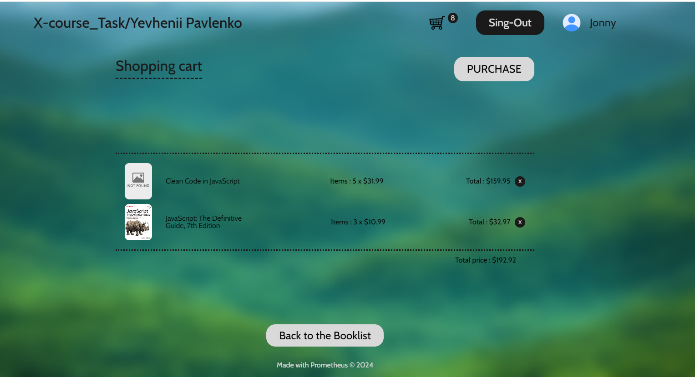

# Book-store (X-course-task)

## Table of Contetns

- [Table of Contetns](#table-of-contetns)
- [About The App](#about-the-app)
- [Live Demo](#live-demo)
- [Features](#features)
  - [For Shoppers](#for-shoppers)
- [Technologies](#technologies)
- [Setup](#setup)
- [Demo](#demo)

## About The App

Discover the best place to shop for programming books at Book-store. The Book-store offers a wide range of programming books that will help you get started in the world of IT. Our user-friendly app provides a seamless shopping experience on any device with a responsive design that adapts perfectly to all screen sizes.

## Live Demo

[Click here](https://sparkiys.github.io/x-cource-task)

## Features

### For Shoppers

- **Shop with Ease:** Browse our extensive catalog of books and make purchases with just a few taps.
- **Save for Later:** Not ready to buy? Add items to your cart and decide later.

## Technologies

- **React and TypeScript:** Built a dynamic and responsive frontend.
- **[SCSS/SASS](https://sass-lang.com/):** Utilized for all design features, enhancing the UI with minimalistic and responsive styles.
- **[React Router](https://reactrouter.com/en/main):** Implemented for seamless navigation between pages.
- **[React Hook Form](https://www.react-hook-form.com/):** Employed for robust form validation.

## Setup

Ensure that you have at least [Node.JS](https://nodejs.org/en) version 18.0.0 installed.

Clone the repository with the following command:

```bash
git clone https://github.com/Sparkiys/x-cource-task.git
```

Install all dependencies by running:

```bash
npm install
```

Start the app with:

```bash
npm run dev
```

## Demo







